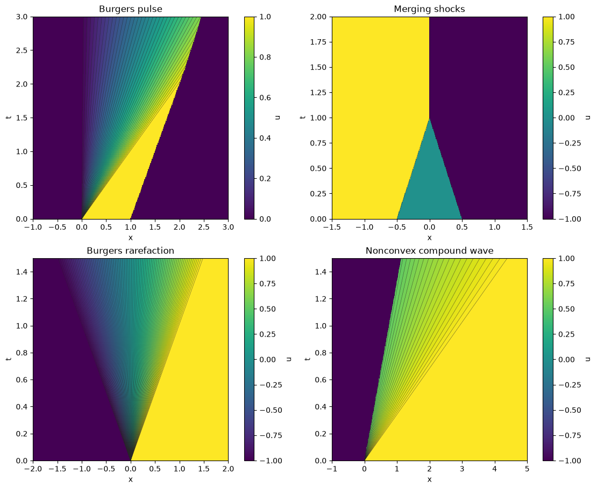

# Dafermos' front tracking for scalar conservation laws

This repository solves the homogeneous, one-dimensional scalar Cauchy problem

$$
 u_t + (f(u))_x = 0,\qquad x\in\mathbb R,
$$

using a polygonal flux and finitely many moving discontinuities. It supports convex,
concave, and nonconvex fluxes. Initial data are piecewise constant, with constant
states extending to infinity on either side. It includes collision handling,
sampling, exact finite-window integration, colour-valued space–time plots, interactive notebooks, and numerical tests.



## Interactive notebooks

| Notebook | Use it for |
| --- | --- |
| [Ready-to-run examples](notebooks/02_ready_to_run_examples.ipynb) | Run all cells: Burgers pulse, merging shocks, rarefaction and a nonconvex compound wave |
| [Front tracking playground](notebooks/01_front_tracking_playground.ipynb) | Supply your own flux, state grid, step data, observation window and snapshot times |

Both notebooks include colour-valued space–time diagrams, exact front paths,
profile snapshots, a time slider with Play, colour-map controls, and image/data
export. They carry a source snapshot, so a downloaded notebook runs independently
in Jupyter or Google Colab. No repository URL is required. Saved figures provide
static previews on GitHub; run the notebooks to activate the controls.

[Notebook instructions](notebooks/README.md) · [Publication guide](PUBLICATION.md)

## Get started locally

Use Python 3.10 or newer. From this project folder:

```bash
python -m pip install -e ".[notebook]"
python -m jupyterlab notebooks/
```

For scripts and static plots without Jupyter:

```bash
python -m pip install -e ".[plot]"
python -m unittest discover -v
python main.py --example pulse --nodes 81 --time 3
```

The core solver needs only NumPy: `python -m pip install -e .`. Matplotlib and
ipywidgets are imported only by plotting and interactive functions. On the
maintainer's workstation, activate the existing `claw` environment before these
commands. Other users can use any Python environment satisfying the dependencies.

The solver is the installable package `fronttrack` in `src/fronttrack/`.
Repository scripts also locate this package without installation through
`_srcpath.py`. The sibling Compact Domain Schemes and Splitting Schemes projects
find it automatically when these folders sit beside each other.

The default example is Burgers' equation, $f(u)=u^2/2$, with initial data
$u=1$ on $[0,1)$ and $u=0$ elsewhere. A rarefaction from zero meets the rightward
shock. Files appear in `results/`:

- `pulse.png`: sampled profiles and front trajectories in the `(x,t)` plane.
- `pulse.npz`: arrays `x`, `times`, `u`, `u_grid`, and `f_values`;
  `u[k,j]` is the sampled value at `times[k], x[j]`.
- `pulse_fronts.csv`: front geometry at output times, with columns
  `time,x,iL,iR,speed`. The states here are **indices**, not physical values.
- `pulse_diagnostics.csv`: time, front count, cumulative collision-cluster count,
  total variation, and the integral over the observation window.

Repeated runs of the same example overwrite its files in the selected output
folder. Use `--output results/run2` to keep a separate run. For computation without
plotting, use `--no-plot`; this also skips trajectory-history storage. The solver itself needs only NumPy. Nothing opens a GUI.

```bash
python main.py --example shock --time 2
python main.py --example rarefaction --nodes 41 --time 1
python main.py --example collision --time 2
python main.py --example nonconvex --nodes 81 --time 2 --xmin -2 --xmax 7
python main.py --help
```

`shock` is the stationary Burgers jump $1 \to -1$. `collision` starts with
$1 \to 0 \to -1$ at $x=-0.5,0.5$; the shocks meet at $(0,1)$ and form a stationary
shock. `nonconvex` uses $f(u)=u^3$ and a truncated, piecewise constant sine profile.
The CLI requires an odd number of nodes so zero is represented exactly; the core
API accepts arbitrary strictly increasing grids, including nonuniform ones.

## Mathematical construction

Choose ordered states $u_{\mathrm{grid}}=[u_0,\ldots,u_M]$, evaluate the flux at those nodes,
and interpolate linearly between them to obtain $f_h$. Approximate the initial
condition by a step function whose values are nodes. The computation evolves
this polygonal-flux problem; it approximates the original smooth-flux problem.

At a jump from $u_L$ to $u_R$, the entropy Riemann construction uses the lower
convex envelope when $u_L<u_R$, and the upper concave envelope when
$u_L>u_R$. Each envelope segment supplies a jump moving at its
Rankine–Hugoniot speed. This is the scalar construction described in
[Knut-Andreas Lie's front tracking notes](https://andreas.folk.ntnu.no/fronttrack/ftrack/scalar.html),
which also give the original reference: C. M. Dafermos, *Polygonal approximations
of solutions of the initial value problem for a conservation law*, J. Math.
Anal. Appl. 38 (1972), 33–41.

For indices `a,b`, the implemented speed is

$$
 s_{ab}=\frac{f(u_b)-f(u_a)}{u_b-u_a}.
$$

The monotone-chain hull in `riemann.py` removes a middle node whenever the two
successive chord slopes violate the requested convexity or concavity. Collinear
nodes are removed too, producing a single contact discontinuity. The resulting
wave list is ordered in **physical space**, with nondecreasing speeds in both
orientations of the initial jump. Speed ordering alone is not an entropy proof;
the envelope condition is essential, especially for nonconvex fluxes.

For Burgers' equation, a downward jump gives one shock of speed $(u_L+u_R)/2$.
An upward jump crosses consecutive state nodes, producing an expanding staircase.
These small fronts satisfy Rankine–Hugoniot for $f_h$; they replace the continuous
rarefaction of the original quadratic flux.

Between interactions each front moves along a straight line. For adjacent fronts
at $x_i \le x_j$, a future collision occurs only if $s_i>s_j$, after

$$
 \Delta t=\frac{x_j-x_i}{s_i-s_j}.
$$

The driver advances all fronts to the earliest collision, discards the incoming
cluster, and solves the Riemann problem between its two exterior states. This
can create one or several outgoing fronts, or no fronts if the exterior states
agree. The procedure repeats until the requested time, with events at that time
resolved before returning. Separate collisions at the same time are processed
without advancing time between them.

## How the modules fit together

All numerical modules live in `src/fronttrack/`; the package re-exports the main
names (`from fronttrack import DiscreteFlux, FrontTracker, solve_riemann`).

| File (in `src/fronttrack/`) | Responsibility | Main interface |
| --- | --- | --- |
| `flux.py` | Validate the state grid, construct the polygonal flux, compute chord speeds and quantize values | `DiscreteFlux(f, u_grid)` |
| `riemann.py` | Construct the entropy hull for one jump | `solve_riemann(iL, iR, flux)` |
| `fronts.py` | Store moving jumps and initialize all initial Riemann problems | `Front`, `FrontCollection`, `initial_fronts` |
| `interactions.py` | Find the earliest adjacent collision and construct outgoing waves | `next_interaction`, `resolve_interaction` |
| `solver.py` | Evolve the solution, resolve clusters, sample, integrate and record paths | `FrontTracker` |
| `main.py` (root) | Choose example data, run requested output times, save arrays/CSV/plots | CLI entry point |
| `convergence.py` (root) | Compare the staircase with an exact Burgers rarefaction | Refinement-study CLI |
| `test_*.py` (root) | Assert flux, entropy, collision and numerical invariants | `python -m unittest discover -v` |

The main dependency flow is `main -> solver -> fronts/interactions -> riemann -> flux`
(the flux object is passed explicitly). Inside the package these are relative
imports.

The root-level `flux.py`, `riemann.py`, `fronts.py`, `interactions.py` and
`solver.py` are deprecated one-line compatibility shims for old notebooks that
did `from flux import DiscreteFlux`. Nothing imports them any more and they can
be deleted; `pyproject.toml` never installs them. `fronttrack.visualization` supplies reusable plots and notebook controls;
`main.py` handles CLI plotting and file export;
importing the numerical modules does not run a simulation or create a figure.
The original print-and-plot test scripts have been replaced with assertion-based
unit tests; example plots now belong to the CLI.

A `Front(x, iL, iR, speed)` represents one jump. Adjacent fronts must satisfy
`left.iR == right.iL`; positions are in spatial order. An initial rarefaction has
several fronts at the same position with ordered speeds, so coincident positions
alone do **not** trigger a collision. The driver only begins cluster resolution
when an approaching pair meets. Do not sort, move, or edit `tracker.fronts`
while using the driver: these are its live mutable objects. Use `snapshot()`
for an independent copy.

## Reading the commented implementation

Read `src/fronttrack/flux.py`, `riemann.py`, `fronts.py`, `interactions.py`, and
`solver.py` in that order, then `main.py` for a complete numerical workflow. Each module has
an overview; classes and functions document inputs and behavior, and inline
comments explain the mathematical decisions and array conventions.

The cleaned-up implementation includes these optimizations:

- `DiscreteFlux` precomputes interpolation slopes on its read-only node arrays.
- `solve_riemann` maintains both node and slope stacks. Accepted hull edges keep
  their speeds, avoiding redundant chord calculations and repeated validation.
- Neighbor scans use `itertools.pairwise`, avoiding copied list slices per event.
- Front objects use dataclass slots to reduce per-front storage.
- `_advance` records and moves fronts in one pass. `_resolve_cluster` isolates
  multiway collision handling from the main `run` loop.
- `integral` walks the step regions directly in $O(N)$ work and uses `math.fsum`
  to reduce cancellation. It needs neither midpoint samples nor binary searches.
- The convergence calculation samples all regions together, instead of
  reconstructing the entire solution separately for each integration interval.
- `main.py` separates argument parsing, observation, export, and plotting into
  `parse_args`, `collect_outputs`, `save_outputs`, and `plot_results`. Fixed-size
  output arrays are preallocated, and `--no-plot` disables trajectory recording.

Local median-of-five timings during cleanup measured approximately 2.8x faster
Riemann solves (300 fixed-seed state pairs on a 401-node nonconvex flux), 1.45x
faster evolution of the 161-node nonconvex example to t=3, and 63x faster evaluation
of the 641-node rarefaction error. These are small-workload measurements on this
machine, not universal speed guarantees. Before/after pulse and nonconvex runs
at 81 nodes retained identical event counts and front geometry within $10^{-13}$.
The readable $O(N)$ event scan remains; there is no heap-based event queue yet.

The original 21 numerical tests additionally check history-free evolution, exported tables,
exact rarefaction error, and integration on intervals as narrow as one floating-point
step. Existing run commands and file formats remain the same.

## Use your own flux and initial data

```python
import numpy as np
from fronttrack import DiscreteFlux, FrontTracker

flux = DiscreteFlux(lambda u: 0.5*u**2 + 0.1*np.sin(3*u),
                    np.linspace(-2, 2, 161))
tracker = FrontTracker.from_values(
    flux,
    positions=[-1.0, 0.0, 0.75],
    values=[0.0, 1.0, -0.5, 0.0],
)
x = np.linspace(-3, 4, 1001)
u_initial = tracker.sample(x)
tracker.run(0.5)
u_half = tracker.sample(x)
tracker.run(2.0)                   # Absolute time, not an additional two units
u_final = tracker.sample(x)
print(tracker.event_count, tracker.total_variation())
print(tracker.integral(-3, 4))
```

With $N$ jump positions, supply $N+1$ values: one on each interval, including the
two exterior half-lines. Jump positions must be finite and strictly increasing.
An empty position list and one value represent a constant solution.

`from_values` maps to the nearest flux node, with ties choosing the lower node.
Out-of-range or nonfinite values are rejected, not clipped. Quantization changes
the initial data and can change its mass; conservation concerns the quantized
initial condition. For exact control, initialize with integer indices:

```python
from fronttrack import solve_riemann

tracker = FrontTracker(flux, positions=[0.0], states=[120, 40])
waves = solve_riemann(120, 40, flux)
```

The supplied flux callable should accept a NumPy array and return matching finite
values (a scalar constant is also supported). `flux.value(u)` evaluates the
polygonal interpolation, while `flux.f(u)` evaluates your original callable.
`flux.rh(a,b)` uses node indices. Equal-state speeds are undefined and rejected;
equal-state Riemann problems instead return an empty list.

### Approximate a smooth or sampled initial condition

Specify cell edges and use representative cell values, together with exterior
states. For a compact profile on `[-1,1]`:

```python
edges = np.linspace(-1, 1, 101)
centers = (edges[:-1] + edges[1:]) / 2
values = np.r_[0.0, np.exp(-8*centers**2), 0.0]
tracker = FrontTracker.from_values(flux, edges, values)
```

This uses midpoint samples; substitute cell averages if desired. The exterior
states here introduce small jumps at the ends of the truncated profile.
Refine both the initial spatial partition and the flux state grid to investigate
convergence for general initial data.

## Numerics, diagnostics and convergence

There are three distinct grids:

1. **State grid** `u_grid`: controls the polygonal flux and allowed solution values.
2. **Initial spatial partition**: controls the step approximation of initial data.
3. **Observation grid** `x`: only samples the evolved solution for plotting/export.

Increasing `--samples` or `--frames` does not refine the numerical flux or initial
data. Output times subdivide straight trajectories but introduce no time-stepping
scheme. There is no CFL time step parameter: interactions determine advancement.

`sample(x)` uses right-hand values at jumps, including the outer right state at a
coincident fan at time zero. `integral(a,b)` integrates the tracked step function
without a sampling-grid quadrature error. Its finite-window value changes when
flux crosses the window boundaries. A compact perturbation with equal far-field
states preserves its excess mass while its support stays within the window;
unequal far-field fluxes produce a net boundary contribution. Total variation is
computed directly as the sum of absolute front strengths and should not increase
apart from floating-point effects.

Run the independent refinement experiment:

```bash
python convergence.py
```

It solves Burgers' initial jump $-1 \to 1$ at $t=1$, where the exact solution is
$\operatorname{clip}(x,-1,1)$. It integrates the absolute error exactly on each staircase interval,
without introducing a plotting-grid error. Expected results are:

| State nodes | Maximum state spacing | L1 error | Observed order |
| ---: | ---: | ---: | ---: |
| 11 | 0.2 | 0.1 | — |
| 21 | 0.1 | 0.05 | 1 |
| 41 | 0.05 | 0.025 | 1 |
| 81 | 0.025 | 0.0125 | 1 |
| 161 | 0.0125 | 0.00625 | 1 |

This experiment measures state-grid convergence for one exact Riemann problem;
it is not a general convergence proof or a test of initial spatial refinement.
For other experiments, compare front geometry and integral diagnostics as well as
sampled plots. When using two sampled resolutions, the observation grid must be
fine enough that its own quadrature error does not dominate.

The automated tests cover Burgers speeds, endpoint interpolation, affine contacts,
convex/concave fans, nonconvex envelope admissibility over all node pairs,
single and simultaneous collisions, annihilation, constant solutions, restarting
at output times, mass conservation, total variation, and rarefaction refinement.

## Scope and implementation limits

This is a readable reference implementation for a homogeneous scalar equation,
not a solver for systems, source terms, spatially varying fluxes, periodic domains,
or imposed boundary conditions (the sibling Compact Domain Schemes project builds
S^1 and torus solvers on top of this package). Plot limits only crop observations; they do not
introduce boundaries, and fronts outside the visible window keep evolving.

Collision prediction scans all adjacent fronts and advancement moves all of them,
so each event costs $O(\text{number of fronts})$, plus a local hull construction. Trajectory
history can also grow substantially. For large runs set `record_history=False`;
`segments` then stays empty. Increase `max_events` from its default 100000 only
when appropriate; hitting the limit raises an error with the simulation left at
its current time, rather than silently returning an incomplete result.

`position_tol` (default $10^{-12}$ in your spatial units) groups fronts close to a
triggered collision point, with an additional roundoff allowance proportional to
coordinate magnitude. Nearly simultaneous events may therefore be combined.
Keep coordinates reasonably scaled and this tolerance much smaller than relevant
front separations; vary it in delicate experiments. Rankine–Hugoniot conservation
is exact algebraically, with floating-point and collision-grouping errors in the
implementation. Flux chord comparisons use floating-point slopes as well, so very
nearly affine fluxes should be checked under refinement.


## Reusable visualization API

```python
import numpy as np
from fronttrack import DiscreteFlux, FrontTracker
from fronttrack.visualization import observe_tracker, plot_profile, plot_spacetime, dashboard

flux = DiscreteFlux(lambda u: 0.5*u**2, np.linspace(-1, 1, 81))
tracker = FrontTracker.from_values(flux, [0, 1], [0, 1, 0])
history = observe_tracker(tracker, np.linspace(-1, 3, 601), np.linspace(0, 3, 101))
plot_spacetime(history)
plot_profile(history, 50)  # saved frame at t=1.5, exact step geometry
# In Jupyter: display(dashboard(history))
```

`observe_tracker` advances its input in place; construct a fresh tracker to
restart. Its colour field is sampled in space and time, while snapshots preserve
actual front positions. All frames share a fixed colour scale. A one-time history
supports snapshots; a space–time plot needs at least two distinct times.
`record_history=False` saves memory when front overlays are unnecessary.

The CLI defaults to 101 observation times for a useful space–time background and
shows at most five overlaid profiles. `--time 0` produces initial profiles without
a fictitious time diagram. The NPZ/CSV export conventions remain unchanged.

The shared module also supplies `observe_grid`, `GridHistory.line` and
`plot_grid_snapshot` for the sibling projects' cell-average schemes. Their
space–time slices are labelled as cell-average observations, with hatching where
artificial-boundary dependence is present. These helpers do not import either
sibling package and do not change the real-line evolution algorithm.
